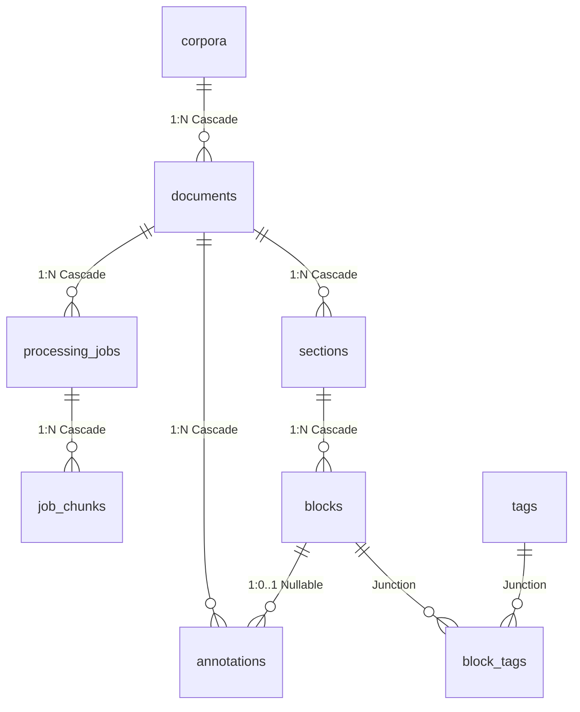

# Database & Indexing Subsystem (`mobile/src/database`)

The application leverages local SQLite storage managed via `expo-sqlite`, coupled with SQLite FTS5 (Full-Text Search) virtual table indexing to ensure rapid search queries over millions of content tokens without search matching pollution.

---

## 1. Relational DDL & Schema Definitions

The SQLite database enforces referential integrity through foreign keys and cascades. The entity-relationship model and schema descriptions are defined below:



### Relational Table Structures
- **`corpora`**: Logical collections of documents.
- **`documents`**: PDF, EPUB, or Markdown files. Includes the unique cryptographic `sha256_hash` to identify the document source.
- **`sections`**: Self-referencing Table of Contents hierarchy (supports chapters, sub-chapters, and sub-sections via recursive foreign keys).
- **`blocks`**: Atomic page text segments, stored as clean, rendered semantic XHTML.
- **`annotations`**: Personal notes and color highlights. `block_id` is nullable to allow imported annotations to exist as **Orphan Notes** if fuzzy anchoring fails.
- **`tags`**: Lowercase, whitespace-stripped tags compiled by Pass 2 LLM or created manually by users.
- **`block_tags`**: Many-to-many lookup linking tags to specific document content blocks.
- **`processing_jobs`**: Long-running ingestion jobs to provide progress tracking for the frontend and prevent data loss.
- **`job_chunks`**: Individual text chunks queued for local LLM processing, enabling per-chunk resume states and crash resiliency.

---

## 2. Decoupled FTS5 Plain-Text Search Index

### The Search Pollution Challenge
If search matches are run directly on raw database fields containing XHTML markup (such as `<p>` or `<span class="highlight">`), queries for words like "class", "span", "p", or "highlight" will pollute the search results, returning thousands of false positive matching blocks.

### The Solution: Decoupled FTS5 Virtual Table
To prevent XHTML element search pollution, the application maintains a dedicated `blocks_fts` virtual table utilizing the SQLite FTS5 extension.
- **Table Definition**:
  ```sql
  CREATE VIRTUAL TABLE IF NOT EXISTS blocks_fts USING fts5(
    block_id UNINDEXED, -- References blocks(id), marked unindexed to avoid indexing overhead
    content             -- Clean plain-text stripped of all HTML/XHTML tags
  );
  ```

---

## 3. Automated SQLite Synchronization Triggers

Rather than forcing the JavaScript frontend to manually manage synchronization between the relational tables and the FTS virtual indexes (which is prone to race conditions and bugs), the database installs native database triggers:

```sql
-- 1. Insert Sync Trigger
CREATE TRIGGER IF NOT EXISTS blocks_fts_ai AFTER INSERT ON blocks BEGIN
  INSERT INTO blocks_fts(block_id, content) VALUES (new.id, new.content);
END;

-- 2. Delete Sync Trigger
CREATE TRIGGER IF NOT EXISTS blocks_fts_ad AFTER DELETE ON blocks BEGIN
  DELETE FROM blocks_fts WHERE block_id = old.id;
END;

-- 3. Update Sync Trigger
CREATE TRIGGER IF NOT EXISTS blocks_fts_au AFTER UPDATE ON blocks BEGIN
  DELETE FROM blocks_fts WHERE block_id = old.id;
  INSERT INTO blocks_fts(block_id, content) VALUES (new.id, new.content);
END;
```

---

## 4. Portability & deduplicated Conflict Resolution

When sharing and importing note backup files (`shared_notes.json`):
1. **Deduplicated Co-existence & Upserts**: If an imported annotation matches the `id` (UUID) of an existing note in the database:
   - **Upsert Matching UUIDs**: Compares the `updated_at` timestamps and retains/overwrites the database record with the most recently modified version.
2. **Visual Merging for Social Reading**: If multiple users highlight the exact same text span under different UUIDs:
   - The database lets them co-exist to support social reading, comments, and collaborative notes.
   - The React Native frontend dynamically and visually merges identical bounds in the reader view so the UI remains uncluttered, while allowing the user to tap and see comments from all authors.
3. **SHA-256 Identification**: Validates the imported document signature. If the signature matches, annotations overlay instantly. If the signature differs but the metadata aligns (e.g. title/author match), the engine initiates the fuzzy character re-anchoring routines.
