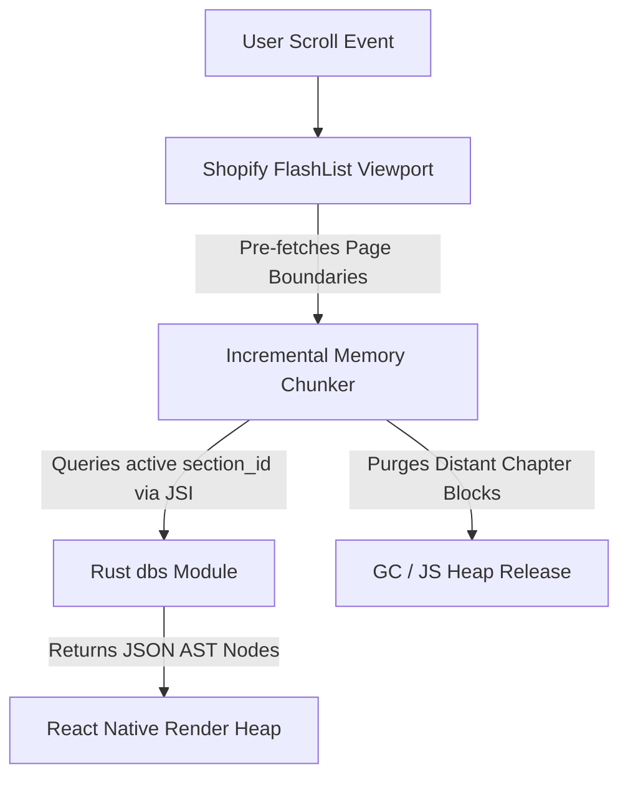

# Mobile Frontend & UX Subsystem (`mobile`)

The React Native application, configured with Expo, serves as the high-performance presentation layer for the Document-to-Reader ecosystem. With all database management, ingestion, and synchronization logic delegated to the native Rust core, the frontend acts as a "thin client." Its primary responsibilities are rendering complex semantic blocks at 120 FPS, managing responsive layouts across device sizes, and capturing user interactions.

---

## 1. High-Performance Scrolling Layout

To achieve seamless 120 FPS scrolling performance on consumer smartphone and tablet devices, the app utilizes Shopify `FlashList` components coupled with an aggressive memory management and dynamic measurement system.



### Rendering Mechanics

1. **FlashList Recycling**: Rather than rendering full documents at once (which exhausts Javascript memory limits), cells containing text blocks are dynamically recycled as they scroll out of view.
2. **Pre-Measured Layout Caching**: To prevent bridge lag and jittery scrolling caused by variable-height text blocks (especially those generated by the LLM), the UI relies on pre-calculated block heights. These heights are resolved against the device's current viewport width and typography settings.
3. **Active Chapter Bound Prefetching**: When a user scrolls within 10% of the active chapter boundaries, the UI initiates asynchronous JSI calls to the `dbs` module to load adjacent sections while purging distant blocks from the Javascript memory space.

---

## 2. Adaptive Grid Interface

The application scales dynamically across mobile screen sizes, transitioning between a robust split-screen pane system on tablets and a collapsible, gesture-driven interface on mobile phones.

```
AppRoot (GestureHandlerRootView)
 └── NavigationProvider
      ├── SmartphoneView (Collapsible Layout)
      │    ├── HeaderBar (Drawer Trigger, Search, ChapterPagination)
      │    ├── NavigationDrawer (Left Slide-out Pane)
      │    ├── ShopifyFlashList (Middle Reading Pane)
      │    ├── FooterBar (ChapterPagination)
      │    └── BottomSheetModal (gorhom Contextual Editor)
      │
      └── TabletView (3-Pane Adaptive Grid Row Layout)
           ├── HeaderBar (App Title, Search)
           └── SplitPaneGrid
                ├── DockedNavigationSidebar (Left Pane: ToC)
                ├── ReaderContainer (Middle Pane + Header/Footer Pagination)
                └── CollapsibleMarginsSidebar (Right Pane: Note Editor & Tags)

```

### Layout Components

* **Tablet 3-Pane Grid**:
* *Left Pane (250dp)*: Persistent navigation sidebar displaying the document corpora, Table of Contents, and chapter hierarchy.
* *Middle Reader Pane (flex: 1)*: Main reading layout displaying clean typography with tailored dynamic HSL styles.
* *Right Margins Sidebar (300dp)*: Docked pane aligning highlights, annotations, and tag autocomplete elements directly adjacent to their source block coordinates.


* **Smartphone Collapsible View**:
* *Left Navigation Drawer*: Gestures trigger a sliding panel containing corpus selectors and chapter indices.
* *Contextual Bottom-Sheet (`@gorhom/bottom-sheet`)*: Tapping any text segment or highlight slides up a smooth contextual editor from the bottom of the screen, preserving the user's reading context.


* **Chapter Navigation Pagination Bar**: Sticky header and footer panels display a horizontal pagination chain (e.g., `< Ch 2: Parser  [Ch 3: Database]  Ch 4: Inference >`) for instant chapter-wide hops.

---

## 3. Native AST Rendering Engine

The frontend no longer relies on heavy, HTML-parsing web wrappers to display document content. Instead, it utilizes a native recursive rendering engine.

By consuming the unified JSON AST (`ASTNode`) payloads returned by the Rust backend, the UI maps elements directly to high-performance React Native `<Text>`, `<View>`, and `<Image>` primitives. This approach guarantees:

* Tailored font styling and clean layout borders.
* Native support for inline code, tables, and list nesting.
* Rapid reflow when the user dynamically adjusts application font sizes or themes.

---

## 4. Rust Core Interoperability (JSI)

The React Native frontend is stripped of direct data processing. It relies entirely on synchronous and asynchronous C++ JSI (JavaScript Interface) Host Objects to communicate with the Rust core.

* **Data Consumption (`dbs` module)**: The frontend does not manage its own local SQLite instance. Instead, all content fetching, vector search requests, and annotation saves are routed through the JSI bridge to the Rust `dbs` module.
* **Action Triggers (`doc_sync` & `inference` modules)**: When a user wishes to sync notes with a peer or process a new PDF, the UI simply dispatches the command via the JSI bridge. The backend handles the complex BLE packet packing, Myers LCS merging, and LLM inference, updating the UI state only when the operations are complete or require interactive conflict resolution.
