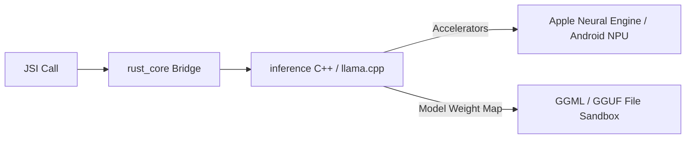

# Inference Subsystem (`rust_core/inference`)

The `inference` sub-crate manages offline inference execution and manages the flexible routing matrix that lets users direct LLM processing to local models, local-network servers, or cloud endpoints.

---

## 1. Local Mobile Inference (llama.cpp)

To run offline, private, zero-cost processing directly on a user's mobile device, the application incorporates embedded `llama.cpp` hooks into `rust_core`.

### Hardware Acceleration Matrix
- **iOS Systems**: Hooks into Apple's CoreML and Apple Neural Engine (ANE) via native Metal performance shaders.
- **Android Systems**: Targets Qualcomm Snapdragon DSPs, MediaTek APUs, and general ARM NEON registers using standard OpenCL / NNAPI execution layers.
- **Memory Optimization**: Leverages strict 4-bit (e.g. `Q4_K_M`) quantization formats. Restricts RAM footprints to $\le 1.8\text{ GB}$ to ensure background processes are not preemptively terminated by the host mobile operating system's out-of-memory (OOM) managers.

---

## 2. LLM Pre-Ingestion Routing Matrix

The user is empowered to balance local privacy, processing speed, and device battery conservation via a dynamic pre-ingestion dashboard:

| Option | Speed (100 Pages) | Cost | Privacy | Host |
| :--- | :--- | :--- | :--- | :--- |
| **Local Inference** | ~45 - 60 Minutes | $0 | 100% Private (Offline) | On-Device llama.cpp |
| **Local Network Link** | ~15 - 20 Minutes | $0 | Local Network (Private) | Wi-Fi LM Studio / Ollama |
| **BYOK Cloud Fallback** | ~5 - 10 Minutes | Pay-per-Token | Cloud Server | Gemini, Claude, or OpenAI |

---

## 3. Wi-Fi Local Network Connection

- **Configuration**: The app lets users input local IP addresses and ports directly (e.g., `http://192.168.1.50:11434` or `http://192.168.1.50:1234`).
- **Endpoint Standards**:
  - Ollama routes use the `/api/generate` and `/api/chat` schemas.
  - LM Studio routes map to `/v1/chat/completions` API patterns.
- **Graceful Fallbacks**: If network packages timeout or drops occur during ingestion, the scheduler caches completed page payloads in SQLite and resumes immediately upon re-connection.

---

## 4. BYOK Cloud Connection

- **Protocol**: Fully offline-first design allows cloud fallback *only* when the user inputs their own API tokens (Bring Your Own Key).
- **Supported Providers**:
  - **Google Gemini**: Integrates with system API endpoints for structured output formatting.
  - **Anthropic Claude**: Leverages tool-use or system prompt structuring.
  - **OpenAI GPT**: Leverages standard JSON schema mode.
- **Storage**: Keys are stored securely in the device's native hardware keystore (iOS Keychain / Android Keystore) via `react-native-quick-crypto` bindings.

---

## 5. Change Log & Addendums

### [v1.3.0] - 2026-05-28
  - Implemented real-world static compiler configuration in `rust_core/inference/build.rs` using the `llama_native` feature flag for statically linking `libllama.a` on iOS and Android.
  - Implemented dynamic fallback resilience: if `llama_native` is disabled, the system runs simulated mock blocks cleanly.
  - Wired all missing JS-to-Rust JSI Promise operations (`resolve` / `reject`) inside `RustParserBridge.cpp` and `RustParserBridge.h`.
  - Added new asynchronous native bridge APIs for `getHeapStats()` and `configureNpu(config)` to monitor RAM/NPU statistics.
  - Designed `ModelDownloader` in `mobile/src/utils/modelDownloader.ts` to manage downloading Gemma-3-1b GGUF weights from Hugging Face into the Expo FileSystem.
  - Created a custom Expo Config Plugin `withNativeLibraries.js` and configured `eas.json` profiles.

### [v1.4.0] - 2026-06-03
- **Deterministic Validation & Retry/Repair Loop**: Built-in deterministic structured output schema validation on the LLM results in `rust_core/inference/src/lib.rs`. Integrated a retry/repair loop utilizing `serde_json` to automatically attempt to parse and repair minor JSON structural deformities in LLM outputs, ensuring schema reliability.
- **Unified JSON AST payload contracts**: Refactored inference payloads in `mobile/src/api/connector.ts` to expect JSON AST `content` structures instead of raw `html_content` blocks, matching the new type contracts.

### [v1.5.0] - 2026-06-03
- **Local Inference Integration with Pass 2 Delineator**: Integrated the `inference` library's local Gemma-3-1b offline GGUF processing with the new `delineator` crate. This allows running prompt-constrained Pass 2 layout parsing locally on-device. Added dynamic mock weights path existence checks (`dummy_model.gguf`) in tests to ensure robust unit test fallback execution without full GGUF load overhead.

### [v1.6.0] - 2026-06-04
- **Resilient Model Downloader**: Implemented a resilient downloader utility in `rust_core/inference/src/downloader.rs` designed to fetch quantized model GGUF weights from Hugging Face. Added targeted sandbox validation, atomic lock-file protection, chunked stream chunk reading, progress telemetry, and range-header resume fallbacks on network interruptions. Exposed FFI interfaces for mobile/desktop compilation targets.

