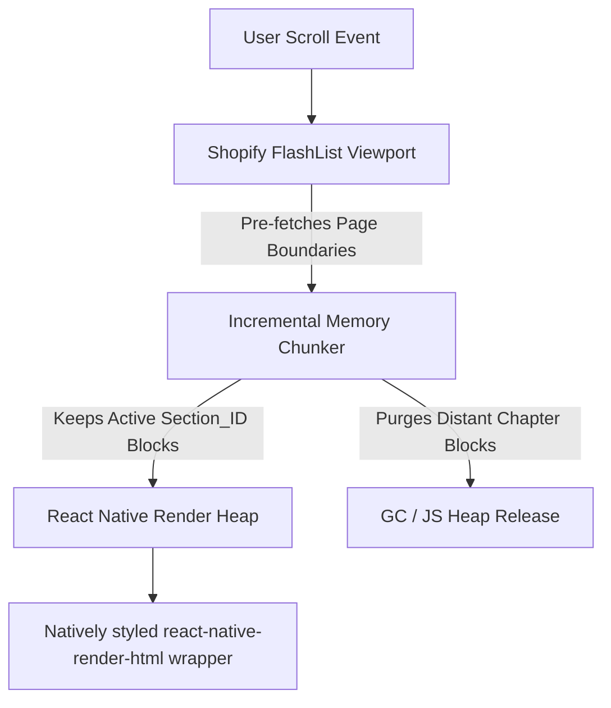

# Mobile Frontend & UX Subsystem (`mobile`)

The React Native application, configured with Expo SDK 50, provides a rich, responsive interface for reading, annotating, searching, and managing document corpora.

---

## 1. High-Performance Scrolling Layout

To achieve 120 FPS scrolling performance on consumer smartphone and tablet devices, the app utilizes Shopify `FlashList` components coupled with a custom paging system.



### Rendering Mechanics
1. **FlashList Recycling**: Rather than rendering full documents at once (which degrades memory limits rapidly), cells containing text blocks are dynamically recycled as they scroll out of view.
2. **Active Chapter Level Swapping**: Database queries are bounded strictly to the active `section_id` representing the active chapter.
3. **Bound Prefetching**: When a user scrolls within 10% of the active chapter boundaries, the app initiates background queries to load adjacent sections while releasing distant blocks from the Javascript memory space.

---

## 2. Adaptive Grid Interface

The application scales dynamically across mobile screen sizes, transitioning between a robust split-screen pane structure on tablets and an active single-screen model on smartphones.

### A. Tablet Layout (3-Pane Grid)
- **Left Pane (250dp)**: Docked table of contents, corpus hierarchies, and active document selectors.
- **Middle Pane (flex: 1)**: Core FlashList text viewer utilizing custom HSL color-scheme typography configurations.
- **Right Pane (300dp)**: Margins pane displaying highlights, annotations, markdown edit slots, and autocomplete tag selectors aligned adjacent to the parent block coordinates.

### B. Smartphone Layout (Collapsible Single Pane)
- **Left Drawer (Slide-out)**: Tap menu triggers slide-out panel for corpus selection and document chapters.
- **Middle Pane (Default)**: Full screen reading view.
- **Bottom-Sheet Modal (`@gorhom/bottom-sheet`)**: Clicking blocks or existing highlights slides up a contextual note/tag editor from the bottom of the screen.

---

## 3. Navigation Pagination Bar

Sticky header and footer panels display a horizontal paginate control that enables rapid jumping across chapter boundaries.
- **Interface**: Looks like `< Ch 2: Parser  [Ch 3: Database]  Ch 4: Inference >`.
- **Logic**: Reads section headers from SQLite based on current document context, updating dynamically as scroll offsets trigger chapter transitions.

---

## 4. Contextual Note Editor

Personal annotation inputs are styled with modern dark-mode layouts supporting full Markdown formatting and normalized badge tag associations.
- **Input Autocomplete**: As user types into the tag field, it executes synchronous local queries:
  `SELECT * FROM tags WHERE name LIKE 'input%' LIMIT 5`
- **Normalization**: Selections are saved as lowercase, whitespace-stripped tag records inside SQLite.

---

## 5. fuzzy Annotations Re-Anchoring (W3C Web Annotations)

If `shared_notes.json` templates are imported for documents with mismatched SHA-256 signatures (such as differing publication editions):
1. **FTS5 Anchor Matching**: System executes SQLite FTS5 queries against the active document's text blocks using structural prefix and suffix buffers:
   ```json
   {
     "prefix": "preceding text context of the highlight...",
     "suffix": "following text context...",
     "offset": 1205
   }
   ```
2. **Offset Recalculation**: Compares character offsets relative to FTS5 matches to fuzzy re-align the anchor at the appropriate text segment.
3. **Orphan Sidebar Fallback**: If no high-confidence block match can be found, the annotation is isolated inside the **Orphan Notes** sidebar.

---

## 6. Change Log & Addendums

### [v1.1.0] - 2026-06-03
- **Recursive JSON AST Native Renderer**: Replaced the legacy HTML rendering wrapper (`react-native-render-html`) in `BlockCell` and reader views with a native recursive rendering engine. Traversing the unified JSON AST (`ASTNode`) format, it maps elements directly to high-performance React Native `<Text>`, `<View>`, and `<Image>` primitives. This supports tailored font styling, clean borders, inline code, and list nesting.
- **AST-Aware Pagination Reflow**: Overhauled `paginateBlocks` and height estimation helpers in `mobile/src/database/pagination.ts` and the `HorizontalReflowReader.tsx` view layer. Dynamic heights, page segment offsets, and sliced text nodes are now resolved using the AST helper `getPlainTextFromAST` to ensure precise word-boundary paging.
