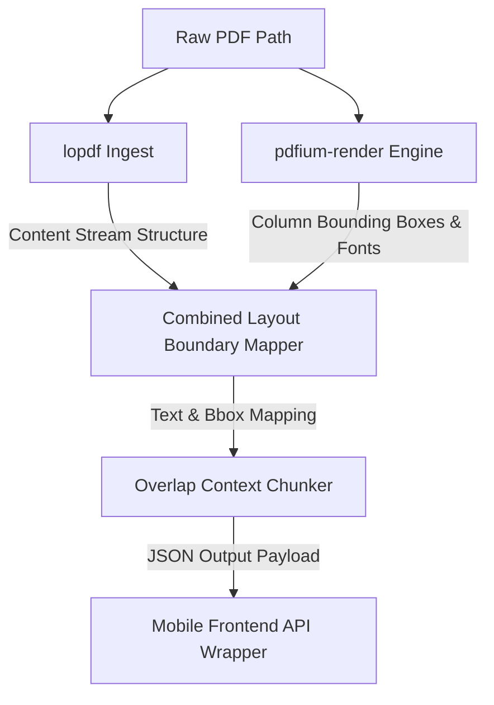

# Parser Subsystem (`rust_core/parser`)

The `parser` sub-crate inside the `rust_core` workspace is a high-performance native library built in Rust. It executes **Pass 1** of the PDF ingestion pipeline: performing low-level structural content stream analysis and high-fidelity visual layout boundary extraction.

---

## 1. Subsystem Architecture

---

## 2. Low-Level Ingestion Components

### A. lopdf Structural Extraction
- **Scope**: Parses raw PDF structural object streams to understand internal PDF catalog mappings, fonts, and resource reference dictionaries.
- **Role**: Extracts raw textual characters directly from text content drawing operations (`TJ`, `Tj`) without layout distortion, ensuring 100% extraction fidelity for tabular structures and text boundaries.

### B. pdfium-render Geometry Extraction
- **Scope**: Compiles and runs high-fidelity native layouts.
- **Role**: Runs rendering-based boundary computations. Identifies geometric coordinates of visual elements (characters, text groups, images, shapes).
- **Bounding Box System**: Layout maps output coordinates scaled to standard PostScript points ($1/72$ inch), mapped from top-left (0,0) relative to page bounds.

### C. Overlap Context Chunker
- **Challenge**: Parsing pages in isolation cuts off context when heading definitions, sentences, or code blocks span across page borders.
- **Strategy**: The chunker prepends a semantic overlap context buffer to each page's raw text.
  - **Buffer Size**: Prefixes the last 3-5 sentences (~100 tokens) of page $N-1$ to the beginning of page $N$.
  - **Deduplication Tag**: Pre-marked with distinct metadata tags so the downstream LLM (Pass 2) ignores the overlap segment during text generation while utilizing it for full semantic context matching.

---

## 3. Sandboxed Image Asset Extraction

- **Execution**: When inline or vector images are encountered in the object streams:
  1. The raw image stream is decoded, uncompressed, and transcoded into high-performance, compressed PNG bytes.
  2. The system computes the cryptographic SHA-256 hash of the image data.
  3. The file is saved inside the app's local sandbox partition under:
     `documents/images/[sha256_hash]_[image_id].png`
  4. The local SQLite database stores the asset reference using the custom dynamic scheme `local-asset://[image_id].png` to ensure iOS sandbox path portability.

---

## 4. Prompt Refinement Tracker (`prompt_history.json`)

Pass 2 prompts are strictly versioned, tracked, and tested to ensure they do not produce schema regressions. The prompt history registry resides inside the tests folder:
`rust_core/parser/tests/prompt_history.json`

### Prompt Verification Checklist
- [ ] **Schema Compliance**: LLM responses must strictly adhere to the `blocks` array output contract.
- [ ] **Layout Integrity**: Golden test files verify multi-column tables, nested list sequences, and code listings are parsed without tag misalignment.
- [ ] **Token Limits**: System prompting remains lightweight, preventing context fatigue on local 4-bit quantized mobile models.
