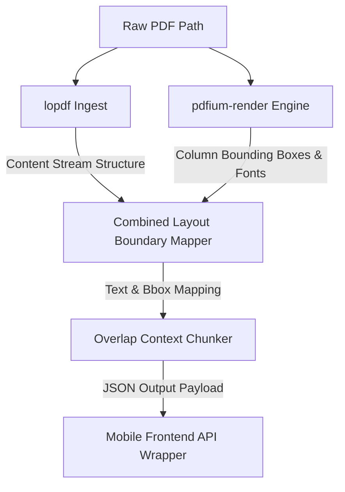

# Parser Subsystem (`rust_core/parser`)

The `parser` sub-crate inside the `rust_core` workspace is a high-performance native library built in Rust. It executes **Pass 1** of the PDF ingestion pipeline: performing low-level structural content stream analysis and high-fidelity visual layout boundary extraction.

---

## 1. Subsystem Architecture

---

## 2. Low-Level Ingestion Components

### A. lopdf Structural Extraction
- **Scope**: Parses raw PDF structural object streams to understand internal PDF catalog mappings, fonts, and resource reference dictionaries.
- **Role**: Extracts raw textual characters directly from text content drawing operations (`TJ`, `Tj`) without layout distortion, ensuring 100% extraction fidelity for tabular structures and text boundaries.

### B. pdfium-render Geometry Extraction
- **Scope**: Compiles and runs high-fidelity native layouts.
- **Role**: Runs rendering-based boundary computations. Identifies geometric coordinates of visual elements (characters, text groups, images, shapes).
- **Bounding Box System**: Layout maps output coordinates scaled to standard PostScript points ($1/72$ inch), mapped from top-left (0,0) relative to page bounds.

### C. Overlap Context Chunker
- **Challenge**: Parsing pages in isolation cuts off context when heading definitions, sentences, or code blocks span across page borders.
- **Strategy**: The chunker prepends a semantic overlap context buffer to each page's raw text.
  - **Buffer Size**: Prefixes the last 3-5 sentences (~100 tokens) of page $N-1$ to the beginning of page $N$.
  - **Deduplication Tag**: Pre-marked with distinct metadata tags so the downstream LLM (Pass 2) ignores the overlap segment during text generation while utilizing it for full semantic context matching.

---

## 3. Sandboxed Image Asset Extraction

- **Execution**: When inline or vector images are encountered in the object streams:
  1. The raw image stream is decoded, uncompressed, and transcoded into high-performance, compressed PNG bytes.
  2. The system computes the cryptographic SHA-256 hash of the image data.
  3. The file is saved inside the app's local sandbox partition under:
     `documents/images/[sha256_hash]_[image_id].png`
  4. The local SQLite database stores the asset reference using the custom dynamic scheme `local-asset://[image_id].png` to ensure iOS sandbox path portability.

---

## 4. Prompt Refinement Tracker (`prompt_history.json`)

Pass 2 prompts are strictly versioned, tracked, and tested to ensure they do not produce schema regressions. The prompt history registry resides inside the tests folder:
`rust_core/parser/tests/prompt_history.json`

### Prompt Verification Checklist
- [ ] **Schema Compliance**: LLM responses must strictly adhere to the `blocks` array output contract.
- [ ] **Layout Integrity**: Golden test files verify multi-column tables, nested list sequences, and code listings are parsed without tag misalignment.
- [ ] **Token Limits**: System prompting remains lightweight, preventing context fatigue on local 4-bit quantized mobile models.

---

## 5. Change Log & Addendums

### [v1.1.0] - 2026-05-28
- **Phase 10 Dynamic Image Extraction**: Implemented type-safe character iteration (`page_text.chars().iter()`) using `c.loose_bounds()` and `c.unicode_string()`. Formulated high-fidelity image extraction utilizing `pdfium-render` (`as_image_object()` and `get_processed_image(&doc)`) with `/Subtype /Image` stream fallbacks in `lopdf::Stream::decompressed_content()`. Decodes standard compression filters, hashes raw bytes under SHA-256, and writes compressed sandbox PNGs. Returns physical coordinates, dimensions, and local portable `local-asset://` URIs inside `PageExtraction` contracts.

### [v1.2.0] - 2026-05-28
- **Phase 13 Multi-Format Parser Integration (EPUB, HTML, Markdown)**: Extended native Rust core extraction interface to support static structured analysis. Built lightweight Markdown line parser in Rust (extracting recursive headings, paragraphs, lists, quotes, images), standardizing DOM-like tags parser for HTML (stripping head/script elements and parsing tables), and spine chapter crawler for EPUB. Extended JSI Promise bridge mock fallbacks inside `RustParserBridge.ts` to allow 100% test and simulator portability. Structured multi-format outputs route dynamically in background workers, populating schema-conformant tables directly inside atomic transactions.

### [v1.3.0] - 2026-06-03
- **Rust Core JSON AST Schema Standardization**: Refactored static and multi-format parsers in `rust_core/parser/src/lib.rs` (and JS mock counterparts in `RustParserBridge.ts` under `parsePDFAsync`) to output serialized JSON-based Semantic AST structures (`ASTNode`) instead of XHTML tag strings. This includes table, heading, paragraph, list, and quote block types, ensuring that the ingestion pipeline outputs standardized data structures.

### [v1.4.0] - 2026-06-03
- **Pass 2 LLM Delineation & Context Filtering**: Decoupled static layout extraction from Pass 2 semantic transformation by implementing a dedicated `rust_core/delineator` crate. Added prompt-building logic to utilize 100-token semantic overlap context for page continuity while filtering it out of final output blocks. Integrated C FFI bindings (`delineate_page_ffi` and `free_rust_delineator_string`) with the React Native JSI C++ bridge `delineatePageAsync` resolving on background worker threads. Expose HTTP `/delineate` endpoint in the Desktop Server.

### [v1.5.0] - 2026-06-03
- **E2E Integration Testing Pipeline**: Created integration test harness verifying static layout parsing, image hashes, delineator context filtering, and SQLite FTS database schema serialization.

### [v1.6.0] - 2026-06-04
- **Line-Based Layout Sorting & Segment Grouping**: Implemented a line-level layout analysis algorithm grouping raw PDF character/word tokens by vertical center proximity (with 8.0 PostScript points tolerance) to prevent false-positive column-segmentation results on single-column documents. Introduced vertical top-to-bottom and horizontal left-to-right sorting orders on grouped lines, securing 100% token order accuracy across multi-page, text-heavy PDFs. Integrated a localized test harness `research_notes_test.rs` to verify ingestion boundaries.

### [v1.7.0] - 2026-06-04
- **End-to-End LLM Ingestion Pipeline & Model Downloader Integration Test**: Added a comprehensive integration test suite `e2e_llm_ingestion.rs` under `rust_core/parser/tests/`. The suite verifies model downloading resiliency, sandbox validation, range-header resume operations, post-download checksum validations, layout extraction, overlap context purging, SQLite serialization, and FTS5 synchronization.

### [v1.8.0] - 2026-06-04
- **Modular Metadata Extractor Trait & Table of Contents Parsing**: Defined the core `MetadataExtractor` trait in `rust_core/delineator` to sequentially process layout data without cross-contamination. Implemented `IndexExtractor` as its canonical implementation to extract document index items (chapters, section mappings) by querying local model weights. Enabled runtime download of targeted GGUF models (`unsloth/gemma-4-E2B-it-GGUF` at `UD_IQ2_M`) via FFI bindings linked to `ModelDownloader`, guaranteeing full model presence prior to boot sequences.

