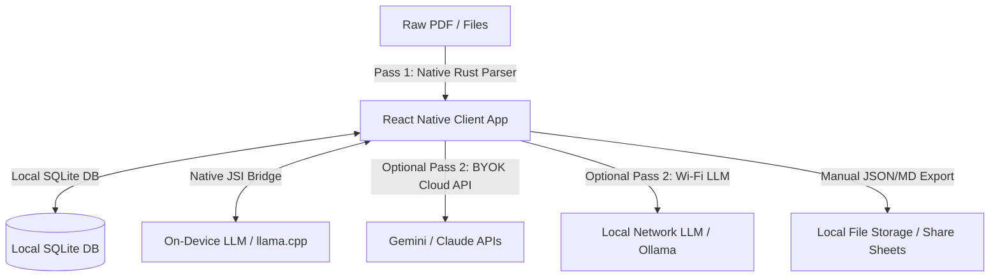
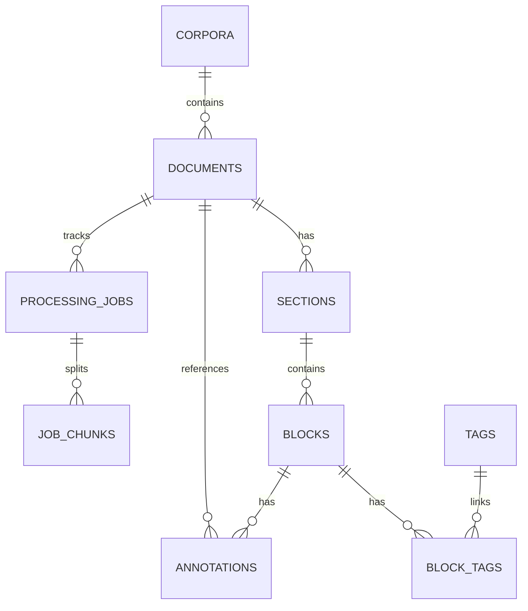

# Project Specification: LLM PDF Ingest & Reader App

This document serves as the definitive, living reference for **system-level definitions and specifications** for the `llm-pdf-ingest` project. Future additions or design modifications must be appended to the **Change Log & Addendums** section at the bottom.

---

## 1. Project Vision & Core Goals

The objective of this project is to build an offline-first, local-only mobile application (iOS & Android) that ingests PDFs (extensible to EPUB/HTML/Markdown) and processes them into structured, indexed, and annotated interactive reading corpora.

### Core Capabilities

| Capability | Specification |
| :--- | :--- |
| **On-Device Ingestion** | **Pass 1 (Rust)**: Statically parses raw layout structure, extracting images as sandbox PNG files (`file://` database URIs).<br>**Pass 2 (LLM)**: Formats text segments into clean semantic HTML/XHTML blocks via structured JSON prompts. |
| **Responsive Reader** | **Tablet (3-Pane)**: Persistent Navigation Sidebar (left), Shopify FlashList Reader Pane (middle), Collapsible Margins Sidebar (right) for annotations.<br>**Smartphone (Collapsible)**: Sliding Drawer Navigation, FlashList Reader, and bottom-sheet Contextual Editor.<br>**Incremental Loading**: Fetches blocks strictly at the active section level, pre-fetching adjacent cells for 120 FPS performance. |
| **Horizontal Pagination**| Horizontal pagination chain (e.g. `< Ch 2  [Ch 3: Focus]  Ch 4 >`) with short titles displayed inside sticky header and footer rows. |
| **Contextual Editor** | Markdown note input and SQLite autocomplete tag badge input (drawer on tablet, bottom-sheet on smartphone). Supports W3C fuzzy re-anchoring. Unanchored notes are stored as **Orphan Notes** in a dedicated sidebar for manual re-anchoring. |
| **Local Export/Import** | JSON/Markdown backup files. Conflicts resolved via **Deduplicated Co-existence** (UUID validation) where matching UUIDs are upserted using the `updated_at` timestamp to overwrite older annotations with newer edits. Also supports **Visual Merging** where different UUIDs on the exact same text span co-exist (enabling social reading) and are visually merged by the React Native frontend to prevent UI clutter. Cryptographic SHA-256 hash checks ensure raw source text is never exported, preserving copyrights. |
| **Storage & FTS5 Search** | Strict sandbox storage. Decoupled SQLite FTS5 plain-text index (stripped of HTML tags) to prevent search matching pollution. |

---

## 2. Tech Stack & Logical Architecture



- **Frontend**: React Native & Expo. Custom HTML block-by-block renderer (not canvas PDFs) leveraging dynamic, tailorable typography and HSL color schemes.
- **Database**: Local SQLite via Expo SQLite, utilizing native FTS5 full-text indexing.
- **Ingestion/LLM Pipeline**: Two-pass processing using Rust (`lopdf` + `pdfium-render`) linked via JSI, feeding to the user's selected LLM.
- **Routing Selection**: Interactive UI pre-ingestion dashboard displaying speeds and estimated processing times:
  - *Local Inference (llama.cpp)*: Offline, private, $0 cost. **Flag: "Local Processing (Estimated: ~45-60 mins)"**.
  - *Local Network (Wi-Fi Ollama/LM Studio)*: Private, $0 cost. **Flag: "Local Network (Estimated: ~15-20 mins)"**.
  - *Cloud Inference (BYOK Gemini/Claude)*: Fast, key required. **Flag: "Cloud Processing (Estimated: ~5-10 mins)"**.

---

## 3. Data Model & Database Schema

All database structures reside in local SQLite storage.



### 1. Corpora (Collections)
```sql
CREATE TABLE corpora (
    id TEXT PRIMARY KEY, -- Client-generated UUID string
    name TEXT NOT NULL,
    description TEXT,
    created_at TEXT DEFAULT CURRENT_TIMESTAMP NOT NULL,
    updated_at TEXT DEFAULT CURRENT_TIMESTAMP NOT NULL
);
```

### 2. Documents (Books/PDFs)
```sql
CREATE TABLE documents (
    id TEXT PRIMARY KEY, -- Client-generated UUID string
    corpus_id TEXT REFERENCES corpora(id) ON DELETE CASCADE,
    title TEXT NOT NULL,
    author TEXT,
    source_type TEXT DEFAULT 'pdf' NOT NULL, -- 'pdf', 'epub', 'markdown'
    sha256_hash TEXT NOT NULL, -- Cryptographic SHA-256 hash of original PDF for unique matching
    metadata TEXT, -- JSON string storing original file size, pages, publisher, etc.
    storage_path TEXT NOT NULL, -- Device local URI path inside the app sandbox
    created_at TEXT DEFAULT CURRENT_TIMESTAMP NOT NULL,
    updated_at TEXT DEFAULT CURRENT_TIMESTAMP NOT NULL
);
```

### 3. Sections (Chapters/Headings)
Represents the structural Table of Contents.
```sql
CREATE TABLE sections (
    id TEXT PRIMARY KEY,
    document_id TEXT REFERENCES documents(id) ON DELETE CASCADE,
    parent_id TEXT REFERENCES sections(id) ON DELETE CASCADE, -- self-referencing hierarchy
    title TEXT NOT NULL,
    depth_level INTEGER DEFAULT 1 NOT NULL, -- 1 = Chapter, 2 = Section, 3 = Subsection
    sort_order INTEGER NOT NULL,
    created_at TEXT DEFAULT CURRENT_TIMESTAMP NOT NULL
);
```

### 4. Blocks (Paragraphs/Tables/Figures)
The atomic elements of content. The `content` column contains parsed and sanitized XHTML content for direct rendering.
```sql
CREATE TABLE blocks (
    id TEXT PRIMARY KEY,
    section_id TEXT REFERENCES sections(id) ON DELETE CASCADE,
    document_id TEXT REFERENCES documents(id) ON DELETE CASCADE,
    block_type TEXT DEFAULT 'paragraph' NOT NULL, -- 'paragraph', 'table', 'code', 'image', 'quote'
    content TEXT NOT NULL, -- Sanitized HTML content
    sort_order INTEGER NOT NULL,
    token_count INTEGER DEFAULT 0,
    created_at TEXT DEFAULT CURRENT_TIMESTAMP NOT NULL
);
```

### 5. Annotations (User Highlights & Notes)
If annotations fail to anchor (e.g., matching across different PDF editions), `block_id` is set to `NULL` to store them as **Orphan Notes** visible in a dedicated sidebar.
```sql
CREATE TABLE annotations (
    id TEXT PRIMARY KEY,
    document_id TEXT REFERENCES documents(id) ON DELETE CASCADE,
    block_id TEXT REFERENCES blocks(id) ON DELETE CASCADE, -- Nullable to support Orphaned Notes
    annotation_type TEXT DEFAULT 'highlight' NOT NULL, -- 'highlight', 'note', 'bookmark'
    color_code TEXT, -- hex code for highlighting
    highlighted_text TEXT, -- exact copy of the source text highlighted
    note_body TEXT, -- user's personal markdown notes
    anchor_metadata TEXT, -- JSON string with fuzzy match context (prefix, suffix, offset) to prevent anchor breakage
    created_at TEXT DEFAULT CURRENT_TIMESTAMP NOT NULL,
    updated_at TEXT DEFAULT CURRENT_TIMESTAMP NOT NULL
);
```

#### Sync Conflict Resolution Rules
- **Upsert Matching UUIDs**: When importing shared or synced backups, if an annotation matches an existing UUID (`id`), the system compares their `updated_at` timestamps and retains/overwrites the record with the most recently modified version.
- **Visual Merging of Co-existing Annotations**: If multiple users highlight the exact same text span, the SQLite database stores these annotations as separate records with unique UUIDs (allowing independent comments/ownership for social reading). The React Native frontend is responsible for visually merging overlapping highlighted ranges in the reading pane to keep the layout clean while preserving access to all associated notes.

### 6. Tags
Normalized lowercase semantic and user-generated tags.
```sql
CREATE TABLE tags (
    id TEXT PRIMARY KEY,
    name TEXT UNIQUE NOT NULL, -- Tag content, lowercase, stripped
    source TEXT NOT NULL, -- 'llm' (generated by Pass 2) or 'user' (manually added)
    created_at TEXT DEFAULT CURRENT_TIMESTAMP NOT NULL
);
```

### 7. Block Tags (Many-to-Many Junction Table)
Maps the relationship between blocks and tags for corpus-wide hyperlinking and concept mapping.
```sql
CREATE TABLE block_tags (
    block_id TEXT REFERENCES blocks(id) ON DELETE CASCADE,
    tag_id TEXT REFERENCES tags(id) ON DELETE CASCADE,
    PRIMARY KEY (block_id, tag_id)
);
```

### 8. Blocks FTS5 Virtual Table (Clean Plain-Text Search Index)
Decoupled SQLite FTS5 table indexing only raw plain-text content (HTML tags stripped) to prevent tag matching pollution. Database triggers automate synchronization.
```sql
CREATE VIRTUAL TABLE blocks_fts USING fts5(
    block_id UNINDEXED, -- References blocks(id) (not tokenized or indexed)
    content             -- Clean, HTML-stripped plain-text of the block (fully indexed)
);
```

### 9. Processing Jobs (Background LLM State Tracking)
Tracks long-running ingestion jobs to provide progress tracking for the frontend and prevent data loss.
```sql
CREATE TABLE processing_jobs (
    id TEXT PRIMARY KEY, -- Unique job UUID
    document_id TEXT REFERENCES documents(id) ON DELETE CASCADE,
    status TEXT DEFAULT 'pending' NOT NULL, -- 'pending', 'processing', 'completed', 'failed'
    progress_percentage INTEGER DEFAULT 0,
    created_at TEXT DEFAULT CURRENT_TIMESTAMP NOT NULL,
    updated_at TEXT DEFAULT CURRENT_TIMESTAMP NOT NULL
);
```

### 10. Job Chunks (Chunk Resiliency)
Holds the individual text chunks queued for local LLM processing. This ensures that if the app or local model crashes, progress is saved per-chunk and can be resumed gracefully.
```sql
CREATE TABLE job_chunks (
    id TEXT PRIMARY KEY, -- Unique chunk UUID
    job_id TEXT REFERENCES processing_jobs(id) ON DELETE CASCADE,
    raw_text TEXT NOT NULL,
    chunk_order INTEGER NOT NULL,
    status TEXT DEFAULT 'pending' NOT NULL, -- 'pending', 'processing', 'completed', 'failed'
    processed_blocks TEXT -- The final JSON from the LLM before insertion into blocks table
);
```

---

## 4. Development Workflow & Parallelization

```
                                [Local SQLite DB Schema]
                                           |
               ┌───────────────────────────┼───────────────────────────┐
               ▼                           ▼                           ▼
       [Frontend UI Team]         [Ingestion Core Team]      [Prompt Engineering Team]
      (React Native + Expo)      (Rust / JSI Interface)       (Local LM-Studio MCP)
```

1. **Local Database Initialization**: Configure local SQLite schema, junction index structures, and FTS5 optimization triggers.
2. **On-Device Rust Core Ingestion**: Implement static PDF layout parsing (Pass 1) using `lopdf` and `pdfium-render`, and integrate `llama.cpp` hooks for offline mobile targets.
3. **Prompt Engineering & Synthetic QA**: Refine structured Pass 2 JSON templates via LM Studio MCP, maintain regression files inside `rust_core/parser/tests/prompt_history.json`, and define multi-column/tabular validation golden tests.
4. **Frontend UI Mocking**: Develop responsive layouts (Smartphone drawers and Tablet 3-pane grids), Shopify FlashList cell recycling, and Markdown note editing tools.
5. **Integration**: Link compiled C++/Rust binaries to React Native using high-speed JSI, wire the pipeline passes, and verify search indexes.

---

## 5. Testing & Quality Assurance

- **Processing Pyramid**: The QA suite relies on an automated **Synthetic PDF Generator** (developed in Rust) that compiles PDFs containing multi-column blocks, headings, code, and tables, alongside a ground-truth JSON sidecar file. The test harness (`cargo test`) parses the PDFs and diffs block accuracy directly.
- **E2E & Backup Integrity**: Automated Maestro (YAML) tests drive standard mobile paths (import, highlight, note-taking, JSON backup sharing) to verify no data regressions occur under device runtimes.

---

## 6. DevOps & CI/CD Strategy

- **EAS (Expo Application Services)**: Automates native builds (`.ipa`, `.apk`, `.aab`) containing custom JSI compiled assets and dependencies, handling code provisioning and submitting to TestFlight / Google Play internal testing tracks.
- **GitHub Actions**: Configured to run Rust test suites (`cargo fmt`, `clippy`), Jest unit tests, and synthetic golden-file PDF parser comparisons on every Pull Request.

---

## 7. Change Log & Addendums

### [v1.0.0] - 2026-05-28
- **Initial Specs**: Established 100% offline, local-only architecture utilizing two-pass native Rust and LLM-assisted layout parsing. Configured SQLite relational schemas, FTS5 plain-text indices, JSI-bindings, visual asset sandbox extraction, and incremental loading for Shopify FlashList rendering.
- **Refactoring & Migration**: Moved to `docs/specs.md` and renamed as part of system documentation streamlining.

### [v1.1.0] - 2026-05-28
- **Ingestion & Sync Expansion**: Added `processing_jobs` and `job_chunks` SQLite tables for background process resiliency. Expanded sync capabilities to specify `updated_at` upsert matching and visual merging of co-existing user annotations.

### [v1.2.0] - 2026-05-28
- **Visual Concepts, LZW Packer, BLE Sync, and Myers Diff Merging**: Added `author_id TEXT` to the SQLite `annotations` table schema. Specified LZW binary notes packaging formats (`.notes`) bundling manifests and base64 PNG sandboxed assets. Outlined Bluetooth LE sync delta communicator partitioning deltas into 512-byte MTU chunks with DJB2 integrity validation, and Myers character-level 3-way conflict merge rules using LCS baseline reconstruction for collaborative sync conflicts.

### [v1.3.0] - 2026-05-28
- **High-Fidelity Binary Image Stream Extraction**: Expanded the Pass 1 JSI payload contract `PageExtraction` to include physical boundaries (`bounding_box: [x, y, width, height]`), page dimension ratios, and `local-asset://` URIs for all extracted images on a page. Extended native `PdfExtractor` trait contracts, implemented dual `pdfium-render` / `lopdf` direct decompression fallback models, and stored assets cryptographically hashed as PNGs in local application sandboxes. Created `localAssetResolver` utility in the React Native frontend to map portable URIs dynamically at runtime, ensuring robust visual block rendering across device App Store updates.

### [v1.4.0] - 2026-05-28
- **Phase 12 Native JSI Vector similarity & RRF Hybrid Search**: Extended high-performance JSI C++ host object bindings with synchronous, SIMD-aligned cosine similarity methods and robust JS fallback math. Introduced database-level Float32Array persistent caching via the `vector_cache` BLOB table (cascaded by block removals). Developed the `searchHybrid` orchestrator fusing BM25 keyword matching with JSI semantic vector similarities using Reciprocal Rank Fusion (RRF).

### [v1.6.0] - 2026-05-28
- **Phase 13 Multi-Format Ingestion Pipelines (EPUB, HTML, Markdown)**: Unified the ingestion core to support native and TS JSI static extraction for EPUB, HTML, and Markdown. Structured formats bypass the chunked LLM pipeline and write sections (recursive heading trees), XHTML content blocks, vector embeddings, binary Float32Array `vector_cache` BLOBs, tags, and autogenerated highlights directly inside atomic SQLite transactions. Preserved PDF LLM Two-Pass ingestion pipeline for complete backwards compatibility.

### [v1.7.0] - 2026-05-30
- **UI Enhancements & Visual Sync Controls**: Renamed the Library dashboard to "Library", added high-performance in-memory text search filtering, integrated header Home navigation triggers (`router.replace`), and built routing mappings for the Concept Graph screen. Integrated sticky horizontal pagination chapter traversal controls, secure JSON backup sharing utilities, asymmetric key manager keypair generation interfaces, and Wi-Fi sync deltas discovery simulations.

### [v1.8.0] - 2026-06-03
- **Production Hardening & JSON Semantic AST Standardization**: Migrated the canonical document storage format from legacy raw XHTML markup to a unified JSON-based Semantic AST (`ASTNode`). Standardized schema updates, interface types between Rust and React Native, and database migrations.
- **Drizzle ORM Integration**: Transitioned local SQLite schema management from raw SQL strings to Drizzle ORM, with startup auto-migration validation checks.
- **FTS5 Plain Text Custom SQLite Extraction**: Upgraded SQLite FTS5 triggers to parse text content natively from JSON AST (supporting fallback grace for legacy/raw strings) using SQLite's JSON extension (`json_tree` / `json_valid`), preventing database insert crashes without data duplication.

### [v1.9.0] - 2026-06-04
- **Database Schema Remediation & Web SQL Mocking**: Aligned the local DDL schema in `schema.ts` to include missing tables (`layout_height_cache`, `vector_cache`) and updated the SQL triggers to parse and extract indexable plain-text dynamically from the standardized JSON AST structures, preventing search pollution. Polyfilled SQLite web support via `Platform.OS === 'web'` checks.

### [v2.0.0] - 2026-06-04
- **Unified CMake Build & Test Automation Wrapper**: Restructured the workspace build configurations under a single root-level CMake configuration. Features architecture-level parameters for NDK compilation toolchains and iOS simulator framework builds, automatic offline-safe upstream checks for `llama.cpp` using local cache folders, and integrated validation passes for automated CTest and Jest testing architectures.

